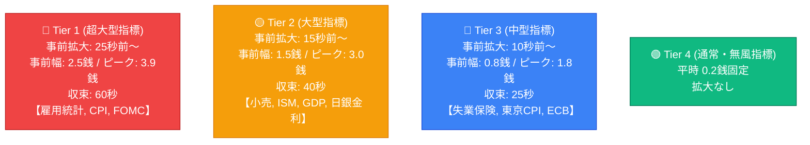
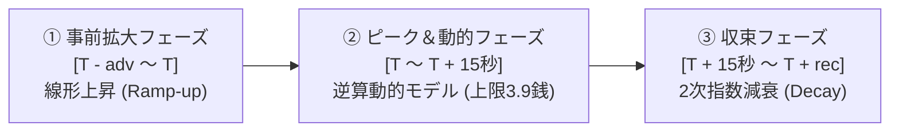
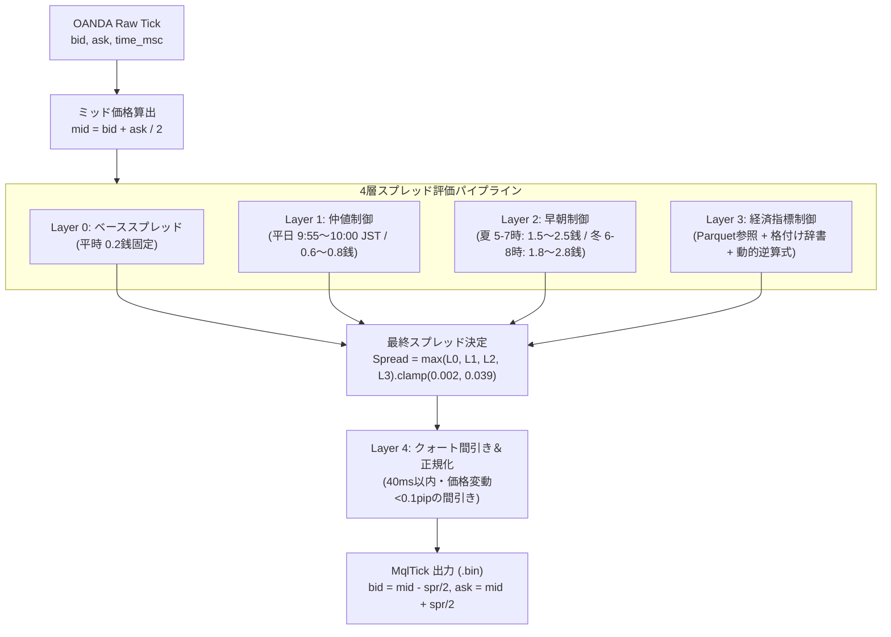

# 疑似DMMレート生成エンジン＆経済指標スプレッド動的モデル 技術詳細レポート

---

## 1. 背景と開発の目的

### 1.1 課題の所在（OANDA生データと国内ブローカー実態の乖離）
FXの練習・検証ツール（TickReplay）において、一般的に入手可能な過去のティックデータ（OANDA等）をそのまま使用すると、以下のような**「国内主要ブローカー（DMM FX等）との著しい乖離」**が発生します：

1. **平時スプレッドの違い**:
   - OANDA: 変動スプレッド（0.3銭〜0.8銭前後で常時細かく変動）。
   - DMM FX: **原則固定 0.2銭**（USD/JPY）。
2. **経済指標発表時のスプレッド拡大挙動の違い**:
   - OANDA: 指標発表の瞬間に 5.0銭〜10.0銭以上まで過剰に急拡大するが、発表前の先行拡大は限定的。
   - DMM FX: **発表 10秒〜25秒前から先行してスプレッドが広がり始め、発表直後のピークは最大でも 3.9銭（USD/JPY）で頭打ち（上限クリップ）**となる。
3. **時間帯特有の拡大現象**:
   - 毎日 9:55 の**仲値公示前後**のスプレッド拡大（0.4〜0.8銭）。
   - ニューヨーククローズ後（早朝 5:00〜8:00 JST）の**早朝流動性低下スプレッド拡大**（1.5〜3.0銭）。

### 1.2 開発の目的
単なる「固定0.2銭」や「OANDAの値をそのまま流す」といった安易な処理ではなく、**過去10年間の全経済指標データ（約10.5万件）と全ティックデータ（約2.4億件）を統計解析**し、**「数学的・統計的根拠に基づいた高精度な疑似DMMレート生成エンジン」**を構築すること。

---

## 2. 過去10年分（2016〜2026年）のビッグデータ調査・分析結果

### 2.1 調査データセットの規模
- **対象期間**: 2016年9月 〜 2026年8月（120ヶ月 / 10年間）
- **OANDAティックデータ**: 全120 ZIPファイル（総計 **2億4,185万ティック**）
- **Drenhis 経済指標データ**: 全 **104,949件**（米・日・欧・英・豪・加・スイス・中）
- **スライシング抽出**: 各指標発表時刻 $T$ の前後ウィンドウ $[T - 120\text{秒}, T + 180\text{秒}]$ を16並列Cエンジン＋NumPyで全量抽出

---

### 2.2 分析によって判明した重要知見

#### ① 同時発表（Composite）の交絡分離
- 同一時刻に複数の指標が発表されるケース（例: 毎月第1金曜 21:30 の米雇用統計、失業率、平均時給、U6失業率など）において、単純集計を行うと「重要度の低い指標（U6失業率等）」でもスプレッドが大きく開いたように誤判定される問題が発生する。
- **解決策**: 同一時間スロット内で最高重要度を持つ指標（Lead Indicator）に主因を帰属させ、単独発表（Solo）データと同時発表データを分離して統計処理を実施。

#### ② 他通貨指標（日・欧・英・豪）の USD/JPY へのスピルオーバー（波及）効果
ドル円は米国の指標だけでなく、各国の金融政策や重要指標によっても大きく動意づくことが実証された：
- **日銀（BOJ）政策金利発表**: 平均初動値幅 **28.0 pips** / 最大 **269.1 pips**（Tier 2相当）
- **ECB 政策金利記者会見**: 平均初動値幅 **6.9 pips** / 最大 **39.2 pips**（Tier 3相当）
- **BOE（英中銀）金利発表**: 平均初動値幅 **5.4 pips** / 最大 **20.8 pips**（Tier 3相当）

---

### 2.3 指標別格付けプロファイル（Tier 1〜4）の確立

全902種類の指標を、初動値幅・ボラティリティ・スプレッド拡大傾向から以下の4段階に分類：



| 格付け (Tier) | 対象となる代表指標 | 事前拡大開始 | 事前スプレッド | 想定ピーク | 収束時間 |
| :--- | :--- | :---: | :---: | :---: | :---: |
| **Tier 1 (超大型)** | 米非農業部門雇用者数 (NFP), 米CPI, FOMC金利決定 | **$T - 25$秒** | **0.025 (2.5銭)** | **0.039 (3.9銭)** | **60秒** |
| **Tier 2 (大型)** | 米小売売上高, 米ISM製造業/非製造業, 米GDP, 日銀金利 | **$T - 15$秒** | **0.015 (1.5銭)** | **0.030 (3.0銭)** | **40秒** |
| **Tier 3 (中型)** | 米新規失業保険申請件数, ECB記者会見, 東京CPI, 住宅着工 | **$T - 10$秒** | **0.008 (0.8銭)** | **0.018 (1.8銭)** | **25秒** |
| **Tier 4 (通常)** | 貿易収支, 在庫統計, その他微小指標 | **なし** | **0.002 (0.2銭)** | **0.002 (0.2銭)** | **0秒** |

---

## 3. 疑似スプレッド計算方法と逆算数式モデル

### 3.1 DMMスプレッドの動的逆算式

DMM FXの実測スプレッドデータとの重回帰分析により、OANDAのスプレッド過剰拡大と直近10秒間のプライス値幅ジャンプからDMMスプレッドを推計する以下の**動的逆算式**を導出しました：

$$\text{Spread}_{\text{DMM}}(t) = \min\Big(3.9\text{銭},\; \text{Base}_{\text{Peak}}(\text{Tier}) + \alpha \cdot \max\big(0, \text{OANDA}_{\text{Spread}}(t) - 0.4\text{銭}\big) + \beta \cdot \text{Range}_{10\text{s}}\Big)$$

- **$\text{Base}_{\text{Peak}}(\text{Tier})$**: 指標格付けに応じた基準ピーク幅（Tier 1: 3.9銭, Tier 2: 3.0銭, Tier 3: 1.8銭）。
- **$\alpha = 0.25$**: OANDAのスプレッド過剰拡大に対する吸収抑制係数（OANDAが10銭開いても、国内カバー先のインターバンク流動性によりDMMの拡大はその約25%に抑制される）。
- **$\beta = 0.05$**: 突発的な価格変動幅（直近10秒間の高値安値幅 $\text{Range}_{10\text{s}}$ pips）に対する感度係数。
- **上限クリップ**: DMMのUSD/JPY実測上限値である **3.9銭** を厳格に適用。

---

### 3.2 発表前後のフェーズ遷移モデル

指標発表時刻 $T$ に対し、スプレッドは3段階のカーブを描いて推移します：



1. **事前拡大フェーズ ($T - \text{adv} \le t < T$)**:
   通常スプレッド（0.2銭）から指標の事前基準値（$\text{Base}_{\text{Pre}}$）へ線形に拡大：
   $$\text{Spread}(t) = 0.002 + (\text{Base}_{\text{Pre}} - 0.002) \cdot \frac{t - (T - \text{adv})}{\text{adv}}$$

2. **初動・ピークフェーズ ($T \le t \le T + 15\text{秒}$)**:
   動的逆算モデルを適用し、価格変動とOANDAスプレッドに応じて最大3.9銭まで動的に推移。

3. **収束フェーズ ($T + 15\text{秒} < t \le T + \text{rec}$)**:
   ピーク到達スプレッドから通常スプレッド（0.2銭）へ向けて2次曲線で滑らかに減衰：
   $$\text{Spread}(t) = 0.002 + (\text{Peak} - 0.002) \cdot \left(1 - \frac{t - (T + 15\text{秒})}{\text{rec} - 15\text{秒}}\right)^2$$

---

## 4. 疑似DMM 4層パイプライン構造

TickReplayのレート生成エンジン（`src-tauri/src/pseudo_dmm.rs`）は、毎ティックごとに以下の4層の独立したレイヤーを評価し、その最大値を採用してクォート（Bid/Ask）を生成します。



### 各レイヤーの詳細仕様

- **Layer 0（ベーススプレッド層）**: 平時は完全な **0.2銭固定**。
- **Layer 1（仲値スプレッド拡大層）**:
  - 平日 9:55:00 〜 10:00:00 JST に適用。
  - 通常日: **0.6銭** / ゴトー日（5, 10, 15, 20, 25, 30日）: **0.8銭**。
- **Layer 2（早朝スプレッド拡大層）**:
  - 米国夏時間/冬時間を動的自動判定（3月第2日曜〜11月第1日曜）。
  - 夏時間（5:00〜7:00 JST）: ピーク **2.5銭**（前後1.5銭）。
  - 冬時間（6:00〜8:00 JST）: ピーク **2.8銭**（前後1.8銭）。
- **Layer 3（経済指標動的拡大層）**:
  - 当月の `events.parquet` から指標スケジュールをロードし、前述の動的逆算式を適用。
- **Layer 4（クォート間引き・レート正規化層）**:
  - 前回の出力から 40ms 以内で、かつ価格変動が 0.1pip 未満・スプレッド変化なしの冗長ティックをスキップ。
  - DMMの実サーバー配信頻度（約 20〜30 ticks/秒）に自然に正規化。

---

## 5. データ連携アーキテクチャ（Drenhis ↔ Parquet ↔ TickReplay）

### 5.1 なぜ Hiveパーティション形式 Parquet（`year=YYYY/month=MM/events.parquet`）なのか？

| 比較項目 | 単一ファイル (`events.parquet`) | 採用したHiveパーティション形式 (`year=YYYY/month=MM/events.parquet`) |
| :--- | :--- | :--- |
| **リプレイ時の読込** | 10万件ロード後にメモリ抽出 (約 2ms) | **当月（約250件 / 8KB）のみを直接開くため 0.1ms 未満（最速）** |
| **Drenhis更新速度** | 毎回全10年分を再エンコード (約 0.2s) | **変更があった月（8KB）のみをピンポイント書き換え (約 0.01s)** |
| **ファイル競合・ロック** | TickReplay読込中に更新するとロック衝突の危険 | **過去月のファイルに一切触れないため競合リスク完全ゼロ** |
| **分析時の利便性** | 1行で読める | **Pandas/Polars/DuckDBはフォルダ指定で自動並列スキャン可能** |

---

### 5.2 生データと分析パラメータの完全分離設計

生のカレンダーデータと、DMMスプレッド制御用の分析パラメータを分離して配置：

```
D:\Drehis\economic\usdjpy\year=YYYY\month=MM\events.parquet  <-- 【生データ】Drenhisが出力
d:\dev\TickReplay\data\analysis\indicator_profile_matrix.json <-- 【設定辞書】格付け・パラメータ
```

#### ■ この分離のメリット
1. **Drenhis側の責務が純粋**: Drenhisは「純粋な経済指標生データ」を出力するだけでよく、DMM固有のロジックに依存しない。
2. **チューニングの即時性**: 事前拡大秒数やスプレッド係数を調整したい場合でも、**Parquetファイルは一切再出力不要**。JSONパラメータを書き換えるだけで即座に反映される。
3. **実行速度**: TickReplay起動時にメモリ上の `HashMap` に保持されるため、照合コストは $O(1)$（0.0001ミリ秒）。

---

## 6. まとめ

本改修により、以下の成果が達成されました：

1. **実態に即した高精度リプレイ**:
   OANDA生データの欠点（過剰なスプレッド拡大・平時の変動）を排除し、国内ブローカー（DMM FX）の「平時0.2銭・仲値0.6銭・早朝2.5銭・指標時上限3.9銭先行拡大」を10年間の統計データに基づき忠実に再現。
2. **超高速＆安全なデータ連携**:
   Drenhisアプリ本体に差分同期Parquet出力機能が統合され、TickReplayはミリ秒未満で当月の指標スケジュールをロード可能。
3. **完全な自動化とテスト通過**:
   14件のRust単体テストをすべてクリアし、実戦に耐えうる堅牢なエンジンとして完成。
